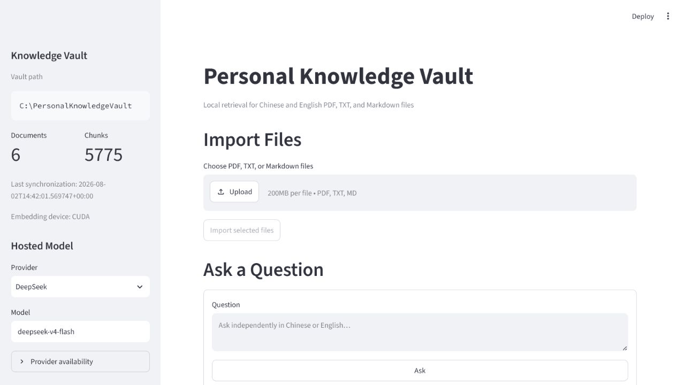

# Personal RAG

Personal RAG is a local-first Windows application for searching a private PDF, TXT, and Markdown vault. Files, extracted text, embeddings, the SQLite manifest, and Chroma stay on the PC. Only the current question, fixed grounding instructions, and the top retrieved passages are sent to the selected hosted chat model.

The MVP is deliberately stateless: every question synchronizes the vault, retrieves from the current index, and creates a new two-message hosted request. Earlier questions and answers are never included.

## Demo

This demo captures a real user case: the user could not remember the exact fact and had only a vague, partly incorrect impression of what they wanted to ask. The relevant detail appeared in one small passage within a six-document, 5,775-chunk vault.



The user asked: “What is the name of the luxury brand that had a naming problem because its customers were female, but the name indicated male?” Despite the vague wording and false premise, the system synchronized the vault, combined semantic and keyword retrieval, found the relevant page, and answered **Charlie**, Revlon’s women’s perfume, with a citation to *Positioning: The Battle for Your Mind*.

> **The system also corrected the user’s memory:** Charlie did **not** have a naming problem. The book presents its masculine name as intentional, successful counter-positioning against the perfume category’s convention of feminine brand names. The original query remains in the GIF because that imperfect recollection is the point of the demonstration.

## Requirements

- Windows 10 or 11
- Python 3.11, 3.12, or 3.13 (64-bit)
- About 2–4 GB of free space for packages, model files, and the index
- Optional NVIDIA GPU with a working CUDA-compatible PyTorch installation
- At least one DeepSeek, Moonshot/Kimi, OpenAI, or OpenAI-compatible API key

OCR is not included. Image-only/scanned PDFs are recorded as empty and are retried only after the file changes.

## Install

Open PowerShell in this repository:

```powershell
python --version
python -m venv .venv313
.\.venv313\Scripts\python.exe -m pip install --upgrade pip
.\.venv313\Scripts\python.exe -m pip install -e ".[dev]"
Copy-Item .env.example .env
```

Edit `.env` locally. At minimum, set an external vault and one hosted-provider key:

```dotenv
KNOWLEDGE_VAULT=C:\PersonalKnowledgeVault
DEEPSEEK_API_KEY=your-key-here
```

Do not commit `.env`. API keys are marked secret in the configuration object and are never placed in prompts, logs, chunks, or the Streamlit debug panel.

Start the application:

```powershell
.\.venv313\Scripts\python.exe -m streamlit run app.py
```

The first document indexing operation downloads `Qwen/Qwen3-Embedding-0.6B`. The application requests CUDA and automatically falls back to CPU when CUDA is unavailable. Confirm the active device in the sidebar. If the pinned PyTorch wheel does not match your NVIDIA setup, install the matching Windows CUDA wheel from the official PyTorch selector, then rerun the application.

The default embedding revision is an immutable Hugging Face commit rather than the moving `main` branch. Changing that revision is treated as incompatible and requires a full rebuild, preventing vectors from different model snapshots from being mixed.

The default chunking window is 300 embedding-model tokens with 50 tokens of overlap. This reduces how much unrelated page content can dilute narrow facts while retaining neighboring context for grounded answers. Changing either value requires **Rebuild Index**.

## Vault contract

The application creates this structure outside the repository:

```text
C:\PersonalKnowledgeVault\
├── library\
│   └── inbox\
└── .rag\
    ├── chroma\
    ├── manifest.sqlite3
    ├── temp\
    └── logs\
```

Put supported documents anywhere under `library`; File Explorer additions are detected recursively before the next question. Browser uploads go to `library\inbox`. `.rag` is application-managed.

Symlinks are not followed, hidden files are ignored, extension matching is case-insensitive, and only `.pdf`, `.txt`, and `.md` are indexed. PDF pages are extracted and split independently so one-based page citations remain precise.

Retrieval is hybrid without a reranking stage. Each question collects five times the final result count from both normalized Qwen cosine similarity and an in-memory Okapi BM25 keyword index built from the current Chroma chunks. BM25 scores are normalized against the strongest keyword match, then combined equally with dense relevance. The BM25 cache is invalidated automatically whenever chunks are added, replaced, deleted, or rebuilt.

## Using the app

- **Refresh Index** scans for added, edited, and deleted files.
- **Rebuild Index** is required when the embedding model/revision, dimensions, collection, or chunking configuration changes.
- Browser imports are staged and verified in `.rag\temp`. Existing names require an explicit **Replace existing file** or **Cancel** choice; files are never automatically renamed.
- Every non-empty question runs synchronization before retrieval. A changed-document failure blocks the hosted request so stale evidence is not returned unknowingly.
- Answer outcomes stay distinct: an empty retrieval reports that no relevant passages were found; retrieved passages that still lack enough evidence produce a non-error insufficient-evidence result; and a provider refusal is shown separately from both. Uncited factual answers continue to fail citation validation.
- While a question is running, the compact status display names the active stage: hosted-model initialization, vault change detection, hybrid retrieval, grounded-context construction, hosted answering, or citation validation. It finishes with the specific success or failure outcome.
- **Retrieval Debug** shows ranks, hybrid relevance scores, separate dense and normalized keyword scores, deterministic chunk IDs, full passages, relative paths, pages, the exact two message bodies sent to the provider, and the hosted model's response before citation validation.
- Answer citations such as `[S3]` are clickable superscripts that jump directly to the matching source passage below.
- **Open File** validates the citation path inside `library` before asking Windows to open it with the default application.

No raw document text is written to application logs. The SQLite manifest stores fingerprints, status, counts, safe error types, and timestamps—not extracted passages.

## Providers

Only fully configured providers appear in the selection list:

| Provider | LangChain model | Required configuration |
|---|---|---|
| DeepSeek | `ChatDeepSeek` | `DEEPSEEK_API_KEY` |
| Kimi/Moonshot | `ChatMoonshot` | `MOONSHOT_API_KEY` |
| OpenAI | `ChatOpenAI` | `OPENAI_API_KEY` |
| OpenAI-compatible | `ChatOpenAI` | `OPENAI_COMPATIBLE_API_KEY` and `OPENAI_COMPATIBLE_BASE_URL` |

Kimi-specific request constraints remain inside the provider factory. K2.5 and K2.6 use non-thinking mode without overriding the API-managed temperature; K3 uses its native always-reasoning defaults. Retrieval and prompting use only the common `llm.invoke(messages)` interface.

## Tests

```powershell
.\.venv313\Scripts\python.exe -m pytest
```

The unit suite uses fake embeddings, vector storage, and chat models, so it does not need model weights or API keys. It covers loaders, multilingual chunking and BM25 matching, the SQLite manifest, new/change/delete synchronization, keyword-cache invalidation, the August 1 → August 7 stale-data regression, provider switching, upload safety, hybrid score blending, retrieval filtering, grounded context, invalid citations, hosted failure debug, and question statelessness.

Live Qwen/Chroma and hosted-provider checks require the normal application dependencies, model download, suitable hardware, and user-owned keys. They are intentionally not invoked by the unit test suite.

## Evaluation

[`evaluation/evaluation_set.jsonl`](evaluation/evaluation_set.jsonl) contains 30 bilingual scenarios against the included synthetic fixture vault. Run the automated retrieval benchmark from the repository root:

```powershell
.\.venv313\Scripts\python.exe -m personal_rag.evaluation
```

The runner copies the fixture into an isolated temporary vault, rebuilds it with the current embedding, chunking, Chroma, synchronization, and hybrid-retrieval implementation, and executes all 30 cases at `top_k=5`. It applies the q29 edit and q30 deletion automatically, checks required paths and stale evidence, prints a concise result, and writes a detailed ignored JSON report under `evaluation/results`. It exits with a nonzero status when an automated check fails and never calls a hosted model or touches the configured personal vault.

The 26-case Recall@5 metric excludes the two absent-information and two conflicting-source cases. The conflict cases still receive automated path checks. The absent-information cases are executed and recorded as `REVIEW` because verifying that a hosted answer refuses unsupported claims cannot be determined from retrieval paths alone. Answer faithfulness, citation correctness, response language, and conflict handling remain manual hosted-model checks.

[`evaluation/personal_vault_evaluation_set.jsonl`](evaluation/personal_vault_evaluation_set.jsonl) contains retrieval regressions discovered in the user-owned personal vault. These cases are manual evaluations, not unit tests, and require the named source documents to be present locally.

## MVP boundaries

There is no OCR, media transcription, EPUB support, automatic categorization, file movement, agent workflow, LangGraph, conversation memory, reranking, document history, cloud sync, or multi-user permission system.
